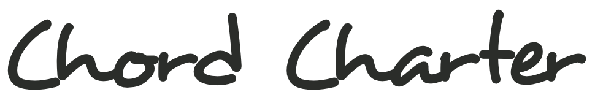
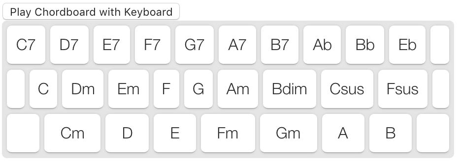

# 

Chord Charter is an app for creating, editing, and organizing chord charts. Chord progressions are written using a Chordboard. The Chordboard connects each key in a qwerty keyboard to a chord name. Chordboards can be created and edited, and a user can select any Chordboard to use to write a chart. 



## Installation

Chord Charter uses [Vue](https://vuejs.org/), [Vuex](https://vuex.vuejs.org/), and [Vue Router](https://github.com/vuejs/vue-router) in the front end, and [Cloud Firestore](https://firebase.google.com/docs/firestore) as a backend. You'll need to initialize the project with Firebase, or you can create a new project in the [Firebase](https://firebase.google.com/) Console.

```
$ npm install vue
$ npm install vuex
$ npm install vue-router

$ npm install --save firebase
$ firebase init
```

Chord Charter uses [Tone.js](https://tonejs.github.io/) for audio playback and [Simple Keyboard](https://github.com/hodgef/simple-keyboard) for the Chordboard interface.

```
npm install tone
npm install simple-keyboard
```

## Project setup
Add Vue, Firebase, Simple Keyboard, and Tone:
```
import Vue from 'vue'
import Vuex from 'vuex'
import VueRouter from 'vue-router'
import firebase from 'firebase/app'
import Keyboard from 'simple-keyboard'
import Tone from 'tone'
```
Once your project is setup in Firebase, add your config (found in general settings):
```
Vue.use(Vuex)
Vue.use(VueRouter)
const firebaseConfig = {
  // add your config
}
firebase.initializeApp(firebaseConfig)
Vue.use(firestorePlugin)
export const db = firebase.firestore()
```
## Demo
Visit [chord-charter.firebaseapp.com](https://chord-charter.firebaseapp.com/) to use the live app.

## Acknowledgements

